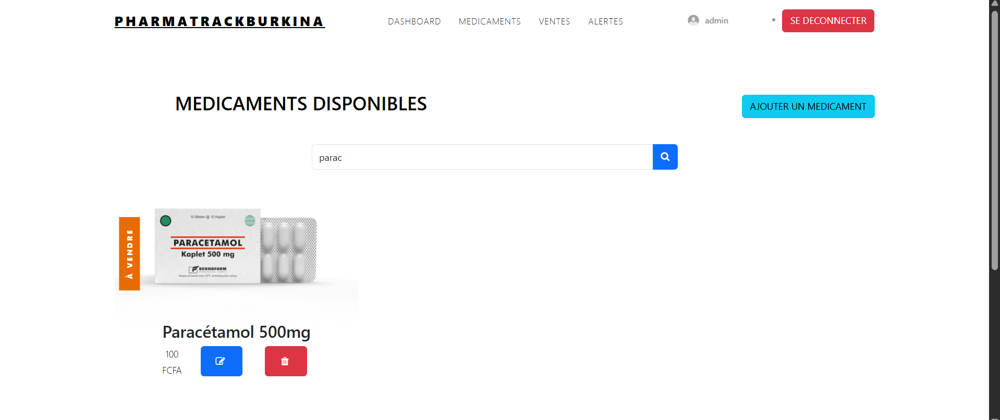

# PharmaTrackBurkina

PharmaTrack Burkina est une application web de gestion et de suivi pharmaceutique destinée aux administrateurs et Utilisateur.
Elle permet d'ajouter et de commander des medicaments, de gérer les stocks, ventes, aletes et médicaments de manière centralisée et intuitive.

This project was generated using [Angular CLI](https://github.com/angular/angular-cli) version 19.2.1.

## MEMBRE DE LEQUIPE

### KOUCHANOU JUAN PRINCE C.D.
### BARA SAKINATOU

## Capture D'ecran

### Invite


### User


### Admin





## Install Dependance

```bash
npm install
```

## Development server

To start a local development server, run:

```bash
ng serve
```

Once the server is running, open your browser and navigate to `http://localhost:4200/`. The application will automatically reload whenever you modify any of the source files.

## Json-server Required

Installer la version indiquer et Demarer le json server avec la commande ci dessous

```bash
npm install -g json-server@0.17.4

json-server --watch db.json --port 3000
```

Voici les endpoints dont vous aurez access une fois ce json-server demarrer:

### http://localhost:3000/users
### http://localhost:3000/medicines
### http://localhost:3000/sales
### http://localhost:3000/alerts

## Routes de l'application Angular

### Routes Publiques

| Path | Composant | Description |
|------|------------|-------------|
| `/` | `HomeComponent` | Page d’accueil publique du site |
| `/login` | `LoginComponent` | Page de connexion (accessible uniquement aux invités) |

---

### Routes Utilisateurs (authentifiés)

| Path | Composant | Description |
|------|------------|-------------|
| `/accueil` | `HomeComponent` | Page d’accueil de l’utilisateur connecté |
| `/cart` | `CartComponent` | Page du panier de l’utilisateur |
| `/medicaments` | `MedicamentComponent` | Liste des médicaments disponibles (lecture seule) |

---

### Routes Administrateurs

| Path | Composant | Description |
|------|------------|-------------|
| `/dashboard` | `DashboardComponent` | Tableau de bord de l’administrateur |
| `/ventes` | `VentesComponent` | Gestion et suivi des ventes |
| `/alertes` | `AlertesComponent` | Gestion des alertes (produits expirés, faibles stocks, etc.) |
| `/medicaments/add` | `AddMedicamentComponent` | Formulaire d’ajout d’un nouveau médicament |
| `/medicaments/edit/:id` | `EditMedicamentComponent` | Formulaire de modification d’un médicament existant (par ID) |

---

### Guards et Accès

| Guard | Rôle |
|--------|------|
| `authGuard` | Protège les routes nécessitant une authentification |
| `guestGuard` | Empêche les utilisateurs connectés d’accéder aux pages publiques comme `/login` |

---

**Résumé rapide :**
- Les routes **publiques** ne nécessitent pas de connexion.
- Les routes **utilisateurs** exigent une authentification.
- Les routes **administrateurs** sont réservées aux comptes avec le rôle `admin`.

## Identifiants de connexion 

- User
```bash
"username": "prince",
"password": "princeprince",
```

- Admin
```bash
"username": "admin",
"password": "admin123",
```

## Tree and architecture 

```
PharmaTrack-Burkina
├─ .angular
├─ .editorconfig
├─ add_medicament.png
├─ alertes.png
├─ angular.json
├─ dashboard.png
├─ db.json
├─ home.png
├─ login.png
├─ medicament_admin.png
├─ medicament_user.png
├─ package-lock.json
├─ package.json
├─ panier.png
├─ public
│  ├─ css
│  │  ├─ aos.css
│  │  ├─ bootstrap
│  │  │  ├─ bootstrap-grid.css
│  │  │  ├─ bootstrap-reboot.css
│  │  │  └─ bootstrap.css
│  │  ├─ bootstrap.min.css
│  │  ├─ bootstrap.min.css.map
│  │  ├─ jquery-ui.css
│  │  ├─ magnific-popup.css
│  │  ├─ owl.carousel.min.css
│  │  ├─ owl.theme.default.min.css
│  │  └─ style.css
│  ├─ fonts
│  │  └─ icomoon
│  │     ├─ demo-files
│  │     │  ├─ demo.css
│  │     │  └─ demo.js
│  │     ├─ demo.html
│  │     ├─ fonts
│  │     │  ├─ icomoon.eot
│  │     │  ├─ icomoon.svg
│  │     │  ├─ icomoon.ttf
│  │     │  └─ icomoon.woff
│  │     ├─ Read Me.txt
│  │     ├─ selection.json
│  │     └─ style.css
│  ├─ images
│  │  ├─ avatar.png
│  │  ├─ bg_1.jpg
│  │  ├─ bg_2.jpg
│  │  ├─ doctor.jpg
│  │  ├─ hero_1.jpg
│  │  ├─ person_1.jpg
│  │  ├─ person_2.jpg
│  │  ├─ person_3.jpg
│  │  ├─ person_4.jpg
│  │  ├─ person_5.jpg
│  │  ├─ products_1.png
│  │  ├─ product_01.png
│  │  ├─ product_02.png
│  │  ├─ product_03.png
│  │  ├─ product_04.png
│  │  ├─ product_05.png
│  │  ├─ product_06.png
│  │  ├─ product_07_large.png
│  │  ├─ shoe.png
│  │  ├─ wave.svg
│  │  └─ women.jpg
│  ├─ js
│  │  ├─ aos.js
│  │  ├─ bootstrap.min.js
│  │  ├─ jquery-3.3.1.min.js
│  │  ├─ jquery-ui.js
│  │  ├─ jquery.magnific-popup.min.js
│  │  ├─ main.js
│  │  ├─ owl.carousel.min.js
│  │  ├─ popper.min.js
│  │  └─ slick.min.js
│  └─ scss
│     ├─ bootstrap
│     │  ├─ bootstrap-grid.scss
│     │  ├─ bootstrap-reboot.scss
│     │  ├─ bootstrap.scss
│     │  ├─ mixins
│     │  │  ├─ _alert.scss
│     │  │  ├─ _background-variant.scss
│     │  │  ├─ _badge.scss
│     │  │  ├─ _border-radius.scss
│     │  │  ├─ _box-shadow.scss
│     │  │  ├─ _breakpoints.scss
│     │  │  ├─ _buttons.scss
│     │  │  ├─ _caret.scss
│     │  │  ├─ _clearfix.scss
│     │  │  ├─ _float.scss
│     │  │  ├─ _forms.scss
│     │  │  ├─ _gradients.scss
│     │  │  ├─ _grid-framework.scss
│     │  │  ├─ _grid.scss
│     │  │  ├─ _hover.scss
│     │  │  ├─ _image.scss
│     │  │  ├─ _list-group.scss
│     │  │  ├─ _lists.scss
│     │  │  ├─ _nav-divider.scss
│     │  │  ├─ _pagination.scss
│     │  │  ├─ _reset-text.scss
│     │  │  ├─ _resize.scss
│     │  │  ├─ _screen-reader.scss
│     │  │  ├─ _size.scss
│     │  │  ├─ _table-row.scss
│     │  │  ├─ _text-emphasis.scss
│     │  │  ├─ _text-hide.scss
│     │  │  ├─ _text-truncate.scss
│     │  │  ├─ _transition.scss
│     │  │  └─ _visibility.scss
│     │  ├─ utilities
│     │  │  ├─ _align.scss
│     │  │  ├─ _background.scss
│     │  │  ├─ _borders.scss
│     │  │  ├─ _clearfix.scss
│     │  │  ├─ _display.scss
│     │  │  ├─ _embed.scss
│     │  │  ├─ _flex.scss
│     │  │  ├─ _float.scss
│     │  │  ├─ _position.scss
│     │  │  ├─ _screenreaders.scss
│     │  │  ├─ _shadows.scss
│     │  │  ├─ _sizing.scss
│     │  │  ├─ _spacing.scss
│     │  │  ├─ _text.scss
│     │  │  └─ _visibility.scss
│     │  ├─ _alert.scss
│     │  ├─ _badge.scss
│     │  ├─ _breadcrumb.scss
│     │  ├─ _button-group.scss
│     │  ├─ _buttons.scss
│     │  ├─ _card.scss
│     │  ├─ _carousel.scss
│     │  ├─ _close.scss
│     │  ├─ _code.scss
│     │  ├─ _custom-forms.scss
│     │  ├─ _dropdown.scss
│     │  ├─ _forms.scss
│     │  ├─ _functions.scss
│     │  ├─ _grid.scss
│     │  ├─ _images.scss
│     │  ├─ _input-group.scss
│     │  ├─ _jumbotron.scss
│     │  ├─ _list-group.scss
│     │  ├─ _media.scss
│     │  ├─ _mixins.scss
│     │  ├─ _modal.scss
│     │  ├─ _nav.scss
│     │  ├─ _navbar.scss
│     │  ├─ _pagination.scss
│     │  ├─ _popover.scss
│     │  ├─ _print.scss
│     │  ├─ _progress.scss
│     │  ├─ _reboot.scss
│     │  ├─ _root.scss
│     │  ├─ _tables.scss
│     │  ├─ _tooltip.scss
│     │  ├─ _transitions.scss
│     │  ├─ _type.scss
│     │  ├─ _utilities.scss
│     │  └─ _variables.scss
│     ├─ style.scss
│     ├─ _site-base.scss
│     ├─ _site-blocks.scss
│     └─ _site-navbar.scss
├─ README.md
├─ search.png
├─ src
│  ├─ app
│  │  ├─ app.component.css
│  │  ├─ app.component.html
│  │  ├─ app.component.spec.ts
│  │  ├─ app.component.ts
│  │  ├─ app.config.ts
│  │  ├─ app.routes.ts
│  │  ├─ component
│  │  │  ├─ accueil
│  │  │  │  ├─ accueil.component.css
│  │  │  │  ├─ accueil.component.html
│  │  │  │  ├─ accueil.component.spec.ts
│  │  │  │  └─ accueil.component.ts
│  │  │  ├─ add-medicament
│  │  │  │  ├─ add-medicament.component.css
│  │  │  │  ├─ add-medicament.component.html
│  │  │  │  ├─ add-medicament.component.spec.ts
│  │  │  │  └─ add-medicament.component.ts
│  │  │  ├─ ajouter-panier
│  │  │  │  ├─ ajouter-panier.component.css
│  │  │  │  ├─ ajouter-panier.component.html
│  │  │  │  ├─ ajouter-panier.component.spec.ts
│  │  │  │  └─ ajouter-panier.component.ts
│  │  │  ├─ alertes
│  │  │  │  ├─ alertes.component.css
│  │  │  │  ├─ alertes.component.html
│  │  │  │  ├─ alertes.component.spec.ts
│  │  │  │  └─ alertes.component.ts
│  │  │  ├─ cart
│  │  │  │  ├─ cart.component.css
│  │  │  │  ├─ cart.component.html
│  │  │  │  ├─ cart.component.spec.ts
│  │  │  │  └─ cart.component.ts
│  │  │  ├─ dashboard
│  │  │  │  ├─ dashboard.component.css
│  │  │  │  ├─ dashboard.component.html
│  │  │  │  ├─ dashboard.component.spec.ts
│  │  │  │  └─ dashboard.component.ts
│  │  │  ├─ drugs
│  │  │  │  ├─ drugs.component.css
│  │  │  │  ├─ drugs.component.html
│  │  │  │  ├─ drugs.component.spec.ts
│  │  │  │  └─ drugs.component.ts
│  │  │  ├─ drugs-list
│  │  │  │  ├─ drugs-list.component.css
│  │  │  │  ├─ drugs-list.component.html
│  │  │  │  ├─ drugs-list.component.spec.ts
│  │  │  │  └─ drugs-list.component.ts
│  │  │  ├─ edit-medicament
│  │  │  │  ├─ edit-medicament.component.css
│  │  │  │  ├─ edit-medicament.component.html
│  │  │  │  ├─ edit-medicament.component.spec.ts
│  │  │  │  └─ edit-medicament.component.ts
│  │  │  ├─ home
│  │  │  │  ├─ home.component.css
│  │  │  │  ├─ home.component.html
│  │  │  │  ├─ home.component.spec.ts
│  │  │  │  └─ home.component.ts
│  │  │  ├─ login
│  │  │  │  ├─ login.component.css
│  │  │  │  ├─ login.component.html
│  │  │  │  ├─ login.component.spec.ts
│  │  │  │  └─ login.component.ts
│  │  │  ├─ medicament
│  │  │  │  ├─ medicament.component.css
│  │  │  │  ├─ medicament.component.html
│  │  │  │  ├─ medicament.component.spec.ts
│  │  │  │  └─ medicament.component.ts
│  │  │  └─ ventes
│  │  │     ├─ ventes.component.css
│  │  │     ├─ ventes.component.html
│  │  │     ├─ ventes.component.spec.ts
│  │  │     └─ ventes.component.ts
│  │  ├─ guard
│  │  │  ├─ auth.guard.spec.ts
│  │  │  ├─ auth.guard.ts
│  │  │  ├─ guest.guard.spec.ts
│  │  │  └─ guest.guard.ts
│  │  ├─ interceptors
│  │  │  ├─ auth.interceptor.spec.ts
│  │  │  └─ auth.interceptor.ts
│  │  ├─ layout
│  │  │  ├─ footer
│  │  │  │  ├─ footer.component.css
│  │  │  │  ├─ footer.component.html
│  │  │  │  ├─ footer.component.spec.ts
│  │  │  │  └─ footer.component.ts
│  │  │  └─ header
│  │  │     ├─ header.component.css
│  │  │     ├─ header.component.html
│  │  │     ├─ header.component.spec.ts
│  │  │     └─ header.component.ts
│  │  ├─ models
│  │  │  ├─ alerte.ts
│  │  │  ├─ cart.ts
│  │  │  ├─ drug.ts
│  │  │  ├─ user.ts
│  │  │  └─ vente.ts
│  │  └─ service
│  │     ├─ alerte.service.spec.ts
│  │     ├─ alerte.service.ts
│  │     ├─ auth.service.spec.ts
│  │     ├─ auth.service.ts
│  │     ├─ cart.service.spec.ts
│  │     ├─ cart.service.ts
│  │     ├─ drug.service.spec.ts
│  │     ├─ drug.service.ts
│  │     ├─ vente.service.spec.ts
│  │     └─ vente.service.ts
│  ├─ index.html
│  ├─ main.ts
│  └─ styles.css
├─ tsconfig.app.json
├─ tsconfig.json
├─ tsconfig.spec.json
└─ ventes.png

```

## AUTHOR AND LICENCE

### KOUCHANOU JUAN PRINCE C.D.
### This Projet is made for a School Project at Virtual University of Ouagadougou, 2025 Angular, All right reserved

